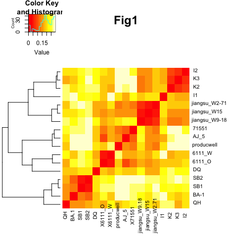

---
output:
    github_document:
    pandoc_args: --webtex
always_allow_html: true
---

<!-- README.md is generated from README.Rmd. Please edit that file -->

```{r, include = FALSE}
knitr::opts_chunk$set(
  collapse = TRUE,
  comment = "#>",
  fig.path = "imgs/",
  out.width = "100%"
)

knitr::opts_chunk$set(echo = TRUE)
```


<!-- badges: start -->


<!-- badges: end -->

# Análise do Metagenoma total - Shotgun 
**Autor: MsC. Kelly Hidalgo**

🇧🇷 Pipeline para a montagem e anotação funcional de metagenomas totais. Este pipeline contempla todas as etapas do processamento, desde a avaliação da qualidade das sequências, trimagem, montagem, cálculo da cobertura, predição e anotação funcional e taxonômica dos genes. 

> 🇪🇸Pipeline para montaje y anotación funcional de metagenomas totales. Este pipeline contempla todas las etapas del procesamiento, desde la evaluación de la calidad de las secuencias, *trimming*, montaje, cálculo de la cobertura, predicción y anotación funcional y taxonómica de genes. 

## Ferramientas bioinformáticas

### Instalação Anaconda

🇧🇷 É recomendável instalar Anaconda, pois é a forma mais fácil para instalar as ferramentas bioinformáticas necessárias pro desenvolvimento deste pipeline. Anaconda é uma distribuição livre e aberta das linguagens *Python* e *R*, utilizada na ciência de dados e bioinformática. As diferente versões dos programas se administram mediante um sinstema de gestão chamado *conda*, o qual faz bastante simples instalar, rodar e atualizar programas. [Aqui](https://conda.io/projects/conda/en/latest/user-guide/install/index.html) se encontram as instruções para a instalação de Anaconda. 

Depois de instalado, *Anaconda* e o gestor *Conda*, podram ser criados *ambientes virtuais* par a instalação das diferentes ferramentas bioinformática que serão usadas. 

> 🇪🇸 Es recomendable instalar Anaconda, pues es la forma más fácil para instalar las herramientas bioinformáticas necesarias para el desarrollo de este pipeline. Anaconda es una distribución libre y abierta de los lenguajes *Python* y *R*, utilizada en ciencia de datos y bioinformática. Las diferentes versiones de los programas se administran mediante un sistema de gestión llamado *conda*, el cual hace bastante sencillo instalar, correr y actualizar programas.  [Aqui](https://conda.io/projects/conda/en/latest/user-guide/install/index.html) se encuentran las instrucciones para la instalación de Anaconda.
>
> Después de instalado *Anaconda* y su gestor *Conda*, podran ser creados *ambientes virtuales* para la instalación de las diferentes herramientas bioinformáticas que serán usadas.

---
# I. Metagenômica

## 0. Organizando os dados

### 0.1. Sequências

🇧🇷 Em este tutorial serão usadas seis metagenomas exemplo para rodar todo o *pipeline*. Descarregue os [*datasets*]() usando o comando `wget`.

> 🇪🇸 En este tutorial serán usados seis metagenomas ejemplo para correr todo el *pipeline*. Descargue los [*datasets*]() usando el comando `wget`.

**Arquivos**

* `sample1_1.fq.gz` e `sample1_2.fq.gz`: Amostra 1
* `sample2_1.fq.gz` e `sample2_2.fq.gz`: Amostra 2
* `sample3_1.fq.gz` e `sample3_2.fq.gz`: Amostra 3
* `sample4_1.fq.gz` e `sample4_2.fq.gz`: Amostra 4
* `sample5_1.fq.gz` e `sample5_2.fq.gz`: Amostra 5
* `sample6_1.fq.gz` e `sample6_2.fq.gz`: Amostra 6

A continuação encontrará uma série de comandos para organizar adequadamente os diretórios com as amostras.

```
## Crie um diretório raiz para todo o processo
mkdir metagenomica

## Entre al nuevo directorio
cd metagenomica/

## Crie um novo diretório para colocar os dados brutos
mkdir 00.RawData

## Entre em 00.RawData
cd 00.RawData/
```
Use o comando `mv` para mover os arquivos até o diretório `00.RawData/`. 

No final do processo de organização deve ver seus diretórios assim:
`ls 00.RawData/`

```
sample1_1.fq.gz   sample1_2.fq.gz   sample2_1.fq.gz   sample2_2.fq.gz   sample3_1.fq.gz   sample3_2.fq.gz   sample4_1.fq.gz   sample4_2.fq.gz   sample5_1.fq.gz   sample5_2.fq.gz   sample6_1.fq.gz   sample6_2.fq.gz
```

É fortmente recomendado rodar os comandos desde o diretório base, que neste caso é: `metagenomica/`

## 1. Controle da Qualidade

## 1.1. Avaliação da qualidade

🇧🇷 Para a avaliação da qualidade será usado o programa [FastQC](http://www.bioinformatics.babraham.ac.uk/projects/fastqc/) que é uma ferramenta que permite observar graficamente a qualidade das sequencias de Illumina. 

> 🇪🇸 Para la evaluación de la calidad será usado el programa [FastQC](http://www.bioinformatics.babraham.ac.uk/projects/fastqc/) que es una herramienta que  permite observar graficamente la calidad de las secuencias de Illumina. 

### 1.1.1. Instalação 

Las instruções para a instalação usando conda se encontram [aqui](https://anaconda.org/bioconda/fastqc). No entanto neste tutorial também serão apresentados.

Como já foi explicado anteriormente, com conda é possível criar ambientes virtuais para instalar as ferramentas bioinformáticas. O primeiro ambiente que será criado se chamará **QualityControl**, onde se instalaram os programas relacionados com esse processo.

> 🇪🇸 [FastQC](http://www.bioinformatics.babraham.ac.uk/projects/fastqc/) es una herramienta para evaluar graficamente la calidad de las secuencias de Illumina. 
>
> Las instrucciones para instalación usando conda se encuentran [aqui](https://anaconda.org/bioconda/fastqc). Sin embargo aqui en este tutorial también serán presentadas
>
> Como ya fue explicado anteriorimente, con conda es posible crear ambientes virutuales para instalar las herramientas bioinformáticas. El primer ambiente que será creado se llamará **QualityControl**, donde se instalaran los programas relacionados con este proceso.

```
conda create -n QualityControl
```
🇧🇷 Durante o processo, o sistema perguntará se deseja proceder com a creação do ambiente, com as opções y/n (sim ou não). Escreva `y` e depois disso o ambiente virutal estará criado.

Para instalar as ferramentas dentro do ambiente anteriormente criado, é necessário ativá-lo.

> 🇪🇸 Durante el proceso, el sistema preguntará sí desea proceder con la creación del ambiente, con las opciones y/n (si o no). Escriba `y` y después de eso el ambiente virtual estará creado.
>
> Para instalar las herramientas dentro del ambiente anteriormente creado, es necesario activarlo

```
conda activate QualityControl
```
🇧🇷 O ambiente estará ativo quando o nome se encontre ao começo da linha do comando, asssim: `(QualityControl) user@server:~/$`.
Posteriormente se procede à instalação do programa:

> 🇪🇸 El ambiente estará activo cuando el nombre de éste se encuentra en el comienzo de la linea de comando, así: `(QualityControl) user@server:~/$`.
> 
> Posteriormente se procede a la instalación del programa:

```
conda install -c bioconda fastqc
```

### 1.1.2. Uso

🇧🇷 A primeira etapa do processo é a avaliação da qualidade das sequências cortas (Illumina paired end) usando *FastQC*, com o objetivo de determianr se é necessário trimar ou filtrar as sequências da baixa qualidade para nos próximos pasos. 

Esta etapa é para identificar principalmente as sequências *outlier* com baixa qualidade ($Q<20$)

Ative o ambiente `QualityControl`:

> 🇪🇸 La primera etapa del proceso es la evaluación de la calidad de las secuencias cortas (Illumina paired end) usando *FastQC*, con el objetivo de determinar sí es necesario trimar o filtrar las secuencias de baja calidad en los próximos pasos. 
>
> Ésta etapa es para identificar principalmente las secuencias *outlier* con baja calidad ($Q<20$).
>
> Active el ambiente `QualityControl`:

```
conda activate QualityControl

## Onde vc está?
pwd
```

🇧🇷 Deve etsar em `~/metagenomica/`.. Se esse não é o resultado del comando `pwd`, use o comando `cd` para chegar no diretório desejado.

> 🇪🇸 Debe estar em `~/metagenomica/`. Si ese no es el resultado del comando `pwd`, use el comando `cd` para llegar en el directorio base.

Execute  **FastQC**:
```
## Crie um directório para salvar o output do FastQC
mkdir 01.FastqcReports
## Run usando 10 threads
fastqc -t 10 00.RawData/* -o 01.FastqcReports/
```

**Sintaxe**
`fastqc [opções] input -o output`

🇧🇷 O comando `fastqc` tem várias opções ou parâmetros, entre eles, escolher o número de núcleos da máquina para rodar a análise, para este exemplo `-t 10`. O input é o diretório que contem as sequências `00.RawData/*`, o `*` indica ao sistema que pode analisar todos os arquivos que estão dentro desse diretório. O output, indicado pelo parâmtero `-o`, é o diretório onde se deseja que sejam guardados os resultados da análise. A continuação se encontram uma explicação detalhada de cada output gerado.

> 🇪🇸 El comando `fastqc` tiene varias opciones o parametros, entre ellas, escoger el número de núcleos de la máquina para correr el análisis, para este caso `-t 10`. El input es el directorio que contiene las secuencias `00.RawData/*`, el `*` indica al sistema que puede analizar todos los archivos que están dentro de ese directorio. El output, indicado por el parametro `-o`, es el directorio donde se desea que sean guardados los resultados del análisis. A continuación se encuentra una explicación detallada de cada output generado.

**Outputs**

🇧🇷 

* Reportes html `.html`: Aqui é possível ver toda informação de qualidade graficamente. 

* Zip files `.zip`: Aqui se encontram cada um dos gráficos de maneira separada. **IGNORE**

Descaregue os arquivos `html` e explore no seu *web browser*. 

Observe as estatísticas básicas que se encontram na primeira tabela. Alí, você pode saber quantas sequências tem, o tamanho e o %GC. O gráfico mais importante para saber a quealidade das leituras, é o primeiro, *Per base sequence quality*. Este gráfico é um boxplot com a distribuição dos valores de qualidade *Phred Score* (eje y) em cada um dos nucleotídeos das leituras (eje x). Se consideram sequências de excelente qualidade quando o $Phred Score > 30$. É norla que o pair 2 apresente uma qualidade um pouco inferior ao pair 1.

> 🇪🇸 Observe las estadísticas básicas que se encuentran en la primera tabla. Allí, ud puede saber cuantas secuencias tiene, el tamaño y el %GC. El gráfico más importante para saber la calidad de las lecturas es el primero, *Per base sequence quality*. Este gráfico es un boxblot con la distribución de los valores de calidad *Phred Score* (eje y) en cada uno de los nucleótidos de las lecturas (eje x). Se consideran secuencias de excelente calidad cuando el $Phred Score > 30$. Es normal que el pair 2 presente una calidad un poco inferior al pair 1. 


### 1.2. Trimagem

> 🇪🇸 1.2 Depuración


🇧🇷 [Trimmomatic](http://www.usadellab.org/cms/?page=trimmomatic) é um programa pra filtrar (remover) leituras ou *reads* curtas de baixa qualidade.

Trimmomatic tem vários parâmetros que podem ser considerados para filtrar leituras com baixa qualidade. No presente tutorial usaremos alguns deles. Se quiser saber que otros parâmetros e como funciona cada um deles, consulte o [manual](http://www.usadellab.org/cms/uploads/supplementary/Trimmomatic/TrimmomaticManual_V0.32.pdf).


> 🇪🇸 [Trimmomatic](http://www.usadellab.org/cms/?page=trimmomatic) es un programa para filtrar (remover) lecturas o *reads* cortas de baja calidad.
>
> Trimmomatic tiene vários parametros que pueden ser considerados para filtrar lecturas con baja calidad. Aqui usaremos algunos. Si quiere saber que otros parametros y como funciona cada uno de ellos, consulte el [manual](http://www.usadellab.org/cms/uploads/supplementary/Trimmomatic/TrimmomaticManual_V0.32.pdf).

### 1.2.1. Instalação 

🇧🇷 Como se trata de uma ferramenta que participa dentro do processo de control de qualidade, será instalada dentro do ambiente virtual **QualityControl**.

> Como se trata de una herramienta que participa dentro del proceso de control de calidad, será instalada dentro del ambiente virtual **QualityControl**

```
# Si no está activado el ambiente
conda activate QualityControl

# Instale Trimmomatic
conda install -c bioconda trimmomatic
```

### 1.2.2. Uso

🇧🇷 Segundo foi avaliado no controle de qualidade, pode ser necessário filtrar algumas leituras com qualidade baixa.

O programa Trimmomatic tem vários parâmetros que podem ser considerados para filtrar reads com baixa qualidade. Aqui usaremos alguns. Se quer saber que outros parâmetros e como funciona cada um deles, consulte o [manual](http://www.usadellab.org/cms/uploads/supplementary/Trimmomatic/TrimmomaticManual_V0.32.pdf).

Para os dados aqui analizados se usara a seguinte linha de comando:

> 🇪🇸 Según fue evaluado en el control de calidad, puede ser necesario filtrar algunas lecturas con calidad baja.
>
> El programa Trimmomatic tiene vários parametros que pueden ser considerados para filtrar lecturas con baja calidad. Aqui usaremos algunos. Si quiere saber que otros parametros y como funciona cada uno de ellos, consulte el [manual](http://www.usadellab.org/cms/uploads/supplementary/Trimmomatic/TrimmomaticManual_V0.32.pdf).
> 
> Para los datos aqui analizados se usará la siguiente linea de comando:

```
# Activa o ambiente QualityControl
conda activate QualityControl

# Crie uma pasta para salvar as reads limpas
mkdir 02.CleanData

# Crie uma pasta para salvar as reads não pareadas
mkdir unpaired

# Corra Trimmomatic
trimmomatic PE -threads 10 00.RawData/sample1_1.fastq.gz 00.RawData/sample1_2.fastq.gz 02.CleanData/sample1_1_paired.fastq.gz unpaired/sample1_1_unpaired.fastq.gz 02.CleanData/sample1_2_paired.fastq.gz unpaired/sample1_2_unpaired.fastq.gz LEADING:3 TRAILING:3 SLIDINGWINDOW:4:15 MINLEN:150
```

🇧🇷 Com o comando anterior você tem que rodar a linha de comando para cada amostra. Se quiser rodar todas as amostras de maneira automâtica é possível usar um *loop* `for` para executar esta tarefa.

> 🇪🇸 Con el comnado anterior ud tiene que correr esa línea de comando para cada muestra. Si quiere correr todas las muestras de manera automática es posible usar un *loop* `for` para ejecutrar esta tarea. 

```
# loop
for i in 00.RawData/*1.fastq.gz 
do
BASE=$(basename $i 1.fastq.gz)
trimmomatic PE -threads 10 $i  00.RawData/${BASE}2.fastq.gz 02.CleanData/${BASE}1_paired.fq.gz unpaired/${BASE}1_unpaired.fq.gz 02.CleanData/${BASE}2_paired.fq.gz unpaired/${BASE}2_unpaired.fq.gz LEADING:3 TRAILING:3 SLIDINGWINDOW:4:15 MINLEN:100
done
```

**Sintaxe**
`trimmomatic PE -threads input_forward input_reverse output_forward_paired output_forward_unpaired output_reverse_paired output_reverse_unpaired [opções]`

🇧🇷 O comando anterior tem muitas partes. Primeiro, o nome do comando é `trimmomatic`, a continuação a opção `PE` indica para o programa que as sequências que irão ser analisadas são de tipo *paired end*. Depois se encontram os inputs, forward (pair1) e reverse (pair2). Depois estão os outputs, sendo o primeiro, as sequências forward pareadas (limpas) e não pareadas ("descartadas") e depois igual para as sequências reverse. Por último se encontram os parâmetros de filtragem. Para este caso usamos os parâmetros `SLIDINGWINDOW`, `LEADING` e `TRAILING`. O primeiro de eles, gera uma janela deslizante, que em este caso vai de 4 em 4 bases, cálcula a média do *Phred Score* e se estiver por baixo de 15 essas bases serão cortadas. `LEADING` corta bases do começo da leitura que estejam por debaixo do *threshold* de qualidade, igualmente faz o `TRAILING` mas no final das leituras. `MINLEN` elimina todas as reads com tamanho menor ao informado. Trimmomatic tem muitos mais parâmetros para customizar, veja no [manual](http://www.usadellab.org/cms/uploads/supplementary/Trimmomatic/TrimmomaticManual_V0.32.pdf).

Depois de rodar Trimmomatic é necessário avaliar a qualidade das sequências limpas usando novamente FastQC.

> 🇪🇸 El comando anterior tiene muchas partes. Primero, el nombre del comando es `trimmomatic`, a continuación la opción `PE` indica para el programa que las secuencias que irán a ser analizadas son de tipo *paired end*. Después se encuentran los inputs, forward (pair1) y reverse (pair2). Después son los outputs, siendo primero las secuencias forward pareadas (limpias) y no pareadas ("descartadas") y después las secuencias reverse. Por último se encuentran los parametros de filtrado. Para este caso usamos los parametros `SLIDINGWINDOW`, `LEADING` y `TRAILING`. El primero de ellos, genera una ventana deslizante, que en este caso va de 4 en 4 bases, cálcula el promedio del *Phred Score* y si está por debajo de 15 esas bases son cortadas. `LEADING` corta bases del comienzo de la lectura si están por debajo de *threshold* de calidad, lo mismo hace `TRAILING` pero al final de las lecturas. `MINLEN` elimina todas las lecturas con tamaño menor al informado. Trimmomatic tiene muchos más parámetros customizables, revise en el  [manual](http://www.usadellab.org/cms/uploads/supplementary/Trimmomatic/TrimmomaticManual_V0.32.pdf).
>
> Después de correr Trimmomatic es necesario evaluar la calidad de las secuencias generadas ("limpias") usando nuevamente FastQC.

```
fastqc -t 10 02.CleanData/* -o 01.FastqcReports/
```

Descargue los reportes `.html` de las secuencias pareadas (i.e. `01.FastqcReports/sample1_1_paired_fastqc.html` y `01.FastqcReports/sample1_2_paired_fastqc.html`).

Faça uma tabela com o número de sequências antes e depois da trimagem para calcular a porcentagem de *reads* que sobreveviveram ao processo.

> 🇪🇸 Haga una tabla con el número de secuencias antes y después de la depuración para calcular el porcentaje de *reads* que sobrevivieron al proceso.


### 1.3 Cobertura dos Metagenoma

🇧🇷 Além de limpar e trimar as sequências com baixa qualidade, é necessário calcular a cobertura dos metagenomas.Este programa usa a redundância de reads nos metagenomas para estimar a cobertura média e prediz a quantidade de sequências que são requeridas para atingir o *"nearly complete coverage"*, definida como $≥95$%  ou $≥99$% de cobertura média. A ferramenta [**NonPareil v3.3.3**](https://nonpareil.readthedocs.io/en/latest/) será usada nesta etapa.

> 🇪🇸 Además de limpiar y *trimar* las secuencias con baja calidad, es necesario calcular la cobertura de los metagenomas. Este programa usa la redundancia de las *reads* en los metagenomas para estimar la cobertura promedio y predice la cantidade de secuencias que son requeridas para conseguir el *"nearly complete coverage"*, definida como $≥95$%  o $≥99$% de la cobertura promedio. La herramienta [**NonPareil v3.3.3**](https://nonpareil.readthedocs.io/en/latest/) será usada en esta etapa.

### 1.3.1. Instalação

🇧🇷 [NonPareil v3.3.3](https://nonpareil.readthedocs.io/en/latest/) é uma ferramenta que será usada para o cálculo da cobertura dos metagenomas. Devido a incompatibilidades com a versão do Python usado para escrever esta ferramenta, ela será instalada em um ambiente diferente ao de controle de qualidade, chamado **NonPareil**.

> 🇪🇸 [NonPareil](https://nonpareil.readthedocs.io/en/latest/) es una herramienta que será usada para el cálculo de la cobertura de los metagenomas. Debido a incompatibilidades con la versión de Python usado para escribir esta herramienta, será instalada en un ambiente diferente al de control de calidad, llamado **NonPareil**.

```
# Crie o ambiente
conda create -n NonPareil

# Instale NonPareil
conda install -c bioconda nonpareil
```

### 1.3.2. Uso

Como *input* para esta análise só é necessário um pair de cada amostra, e deve estar sem compressão.


```
# Crie o diretório pra o output
mkdir 03.NonPareil

# entre no directorio
cd 03.NonPareil

# Copie os pair 1 da pasta 02.CleanData

cp ../02.CleanData/*_1* ./

# Descomprimir 
gunzip -d *

```

🇧🇷 Agora está tudo pronto para rodar a análise, mas antes disso tome-se o tempo para entender o comando que vai usar. Para conhecer que é cada um dos argumentos, explore o menú de ajuda da ferramenta. 

> 🇪🇸 Ahora está todo listo para correr el análisis, pero antes de eso tómese el tiempo para entender el comando que va a usar. Para conocer que es cada uno de los argumentos, explore el menú de ayuda de la herramienta.

```
# Ative o ambiente NonPareil
conda activate NonPareil

# Explore o menú da ferramenta
nonpareil --help

# Comando do NonPareil para cada amostra
nohup nonpareil -s sample1.fq -T kmer -f fastq -b sample1 -t 6 &

```
No caso, se tiver várias amostras pode usar o seguinte loop para facilitar o processo.

```
for i in ./*.fq
do
BASE=$(basename $i .fq)
nonpareil -s $i -T kmer -f fastq -b $i -t 6
done
```

**Sintaxe**

* `-s`: caminho para o *input* 
* `-T`: algorítmo a ser usado. `kmer` é recomendado para arquivos `.fastq` e `alignment` é recomendado para arquivos `.fasta`.
* `-f`: indique aqui o formato do input (p.e. `fastq` ou `fasta`)
* `-b`: prefixo para os *outputs*
* `-t`: número de threads

🇧🇷 Ao terminar esse processo, o programa terá criado varios [*outputs*](https://nonpareil.readthedocs.io/en/latest/redundancy.html#output) por cada amostra. Descarregue os arquivos `.npo`. Os quais são tabelas delimitadas por tabulações com seis colunas. A primeira coluna indica o esforço de sequenciamento (em número de reads), as demais colunas têm informação sobre a distribuição da redundância a determinado esforço de sequenciamento. Usando os arquivos `.npo` e o R, pode gráficar as curvas de saturação. A continuação se encontra o script.
Além dos arquivos `.npo` é necessário criar um arquivo chamado `samples.txt`, o qual deve ter três colunas (separadas por tabulações), a primeira terá o nome de cada arquivo `.npo`, a segunda o nome da amostra, e a terceira a cor em formato JSON que vai ser usada para a curva. Veja o exemplo abaixo

> 🇪🇸 Al terminar este proceso, el programa habrá creado varios [*outputs*](https://nonpareil.readthedocs.io/en/latest/redundancy.html#output) por cada muestra. Descargue los archivos `.npo`. Los cuales son tablas delimitadas por tabulaciones con seis columnas. La primera columna indica el esfuerzo de secuenciación (en número de *reads*), las demás columnas tienen información sobre la distribución de la redundancia a determinao esfuerzo de secuenciación. Usando los archivos `.npo` e R, puede gráficar las curvas de saturación. A continuación se encuentra el script.
>
> Además de los archivos `.npo` es necesario crear un archivo llamado `samples.txt`, el cual debe tener tres columnas (separadas por tabulaciones), la primera tendrá el nombre de cada archivo `.npo`, la segunda el nombre de la muestra, y la tercera el color en formato JSON que va a ser usado para la curva. vea el ejemplo abajo

```
# Cria o arquivo samples.txt
nano samples.txt
```

Arquivo `samples.txt`

```
File    Name    Col
sample1.fq.npo    sample1   "#c151b6"
sample2.fq.npo    sample2   "#5eb04d"
sample3.fq.npo    sample3   "#7d65ce"
sample4.fq.npo    sample4   "#b5b246"
sample5.fq.npo    sample5   "#688ccd"
sample6.fq.npo    sample6   "#4bb092"
```

Esse arquivo pode ser criado em um bloco de notas ou em excel, mas deve ser separado por tabulações.

```{r, eval=FALSE}
install.packages("Nonpareil") #para instalar o pacote, só uma vez
library(Nonpareil) # ativa o pacote
setwd("~/03.NonPareil") # determina seu diretório de trabalho (coloque o seu, onde colocou os arquivos .npo)

samples <- read.table('samples.txt', sep='\t', header=TRUE, as.is=TRUE); #lê o arquivo samples.txt com a informação das amostras

attach(samples);
nps <- Nonpareil.set(File, col=Col, labels=Name, 
                     plot.opts=list(plot.observed=FALSE, 
                                    ylim = c(0, 1.05),
                                    legend.opts = FALSE)) #grafica as curvas

Nonpeil.legeng(nps, x.intersp=0.5, y.intersp=0.7, text.width=1.2) #coloca e personaliza a legenda
  
detach(samples);
summary(nps) #mostra o resumo em forma de tabela
```

Vai obter um gráfico com as curvas de saturação de cada amostra, como este:


🇧🇷 As linhas tracejadas <font color='red'> vermelha </font> e <font color='gray'> cinza </font> representam os *threshold* de 95% e 99% da cobertura média, respeitivamente. O circulo em cada curva representa a cobertura atual das amostras, o ideal é que esteja por cima do primeiro *threshold*. As curvas também apresentam a estimação de quanto esforço de sequenciamento é necessário (zetas no eixo x).

> 🇪🇸 Las líneas punteadas <font color='red'> roja </font> y <font color='gray'> gris </font> representam los *threshold* de 95% y 99% de cobertura promedio, respectivamente. El círculo en cada curva representa la cobertura actual de las muestras, lo ideal es que estén por encima del primer *threshold*. Las curvas también presentan la estimación de cuanto esfuerzo de secuenciación es necesario (flechas en el eje x). 


### 1.4. Análise de Distâncias MinHash

🇧🇷 Após obter as sequências limpas, de boa qualidade, e determinar a cobertura dos metagenomas, é possível fazer a montagem. No entanto, pode ser incluído um passo extra antes da montagem e é verificar a similaridade dos datasets para determinar se pode ser usada a abordagem de *co-assembly*, onde são misturadas as *reads* de vários metagenomas para gerar os contigs. O programa [**Mash v2.3**](https://mash.readthedocs.io/en/latest/) usa uma técnica chamada redução de dimensionalidad *MinHash* que avalia as distâncias um a um entre os datasets. 

> 🇪🇸 Después de obtener las secuencias limpias, de buena calidad, y determinar la cobertura de los metagenomas, es posible hacer el montaje. Sin embargo, puede ser incluído un paso extra antes del montaje y es verificar la similaridade de los datasets para determinar si puede ser usado el abordaje de *co-assembly*, donde son mezcladas las *reads* de varios metagenomas para generar los contigs. El programa [**Mash v2.3**](https://mash.readthedocs.io/en/latest/) usa una técnica llamada reducción de dimensionalidad *MinHash* que evalua las distancias un a un entre los datasets.

### 1.4.1. Instalação

🇧🇷 [Mash v2.3](https://mash.readthedocs.io/en/latest/) é uma ferramenta que usa a técnica de redução da dimensionalidade *MinHash* para calcular as distâncias um a um entre os datasets, assim, é possível determinar se os metagenomas são similares ou não para serem montados usando *co-assembly*. 

🇧🇷 Por ser considerada uma ferramenta que participa no processo de assembly, será instalada dentro de um ambiente virtual chamado **Assembly**.

> 🇪🇸 [Mash](https://mash.readthedocs.io/en/latest/) es una herramienta que usa la técnica de reducción de dimensionalidad *MinHash* para calcular las distancias un a un entre los datasets, así, es posible determinar si los metagenomas son similares o no para ser ensamblados usando *co-assembly*.
>
> 🇪🇸 Por ser considera una herramienta que participa en el proceso de ensamble, será instalada dentro de un ambiente virtual llamado **Assebly**.

```
# Crie o ambiente virtual
conda create -n Assembly

# Instale Mash
conda install -c bioconda mash
```

### 1.4.2. Uso

```
## Crie uma pasta para o output
mkdir 04.MinHash
```

🇧🇷  O primeiro paso é concatenar os reads 1 e 2, e armazenar eles na nova pasta criada `04.MinHash/`.

**Nota:** Se você trimou suas sequências, deve usar os arquivos gerados pelo **Trimmomatic** na pasta `02.CleanData`, se pelo contrário suas sequências estavam de boa qualidade e não foi necessário trimar, use os arquivos originais, que estão dentro da pasta `00.RawData/`.

> 🇪🇸 
>
>**Nota:** Si usted filtró sus secuencias, debe usar los archivos generados por **Trimmomatic** en el directorio `02.CleanData`, si por el contrario sus secuencias estaban de buena calidade y no fue necesario filtrar, use los archivos originales, que están dentro de la carpeta `00.RawData`.

```
for i in 02.CleanData/*_1_paired.fq.gz
do
BASE=$(basename $i _1_paired.fq.gz)
cat $i 02.CleanData/${BASE}_2_paired.fastq.gz > 04.MinHash/${BASE}.fq
done
```

🇧🇷 Depois será criado um *sketch* para combinar todas as amostras. Usando `mash info` pode verificar o conteúdo e, em seguida, estimar as distâncias par a par:

> 🇪🇸 
>
> Después será creado un *sketch* para combinar todas las muestras. Usando `mash info` puede verificar el contenido y, en seguida, estimar las distancias par a par:

```
mash sketch -o 04.MinHash/reference 04.MinHash/sample1.fq 04.MinHash/sample2.fq 04.MinHash/sample3.fq 04.MinHash/sample4.fq 04.MinHash/sample5.fq 04.MinHash/sample6.fq

#verifiyng
mash info 04.MinHash/reference.msh
```

**Sintaxe**

`mash sketch -o reference [inputs]`

`mash info reference.msh`

* `sketch`: Comando para criar um *sketch*, combinando todas as amostras, recomendado quando têm mais de três amostras.
* `-o`: caminho pro *output*, criará um *sketch* `.msh`.
* `inputs`: liste os inputs (sequencias concatenadas dos pair1 e pair2)
* `info`: pode verificar o conteúdo do `sketch`
* `reference.msh`: *sketch* criado

Por último, calcule as distâncias entre cada par de metagenomas usando `mash dist` e salve o resultado no arquivo `distancesOutput.tsv`.

```
mash dist 04.MinHash/reference.msh 04.MinHash/reference.msh -p 6 > 04.MinHash/distancesOutputFinal.tsv
```

**Sintaxe**
`mash dist [reference] [query] [options]`

* `dist`: comando para calcular as distâncias entre cada par de mategenomas, baseado na distância *MinHash*.
* `reference`: aqui pode colocar o *sketch* criado, ou arquivos `.fq`, `fasta`.
* `query`: ídem
* `-p`: número de threads

Descarregue o output (`04.MinHash/distancesOutputFinal.tsv`) e use o seguinte script do R para plotar um heatmap com as distâncias.

```{r, eval=FALSE}
setwd("~/04.MinHash/")

 data <- read.table("distancesOutputFinal.tsv")

 #install.packages("vegan")
 library(vegan)
 set.seed(2)
 
 dst = as.matrix(data)
 
 #install.packages("gplots")
 library(gplots)
 set.seed(2)
 x <- matrix(rnorm(100), nrow = 5)
 dist.fn <- function(x) as.dist(1-cor(t(x)))
 hclust.com <- function(x) hclust(x, method="complete")
 
 dev.off()
 h.ori <- heatmap.2(dst, trace="none", distfun=dist.fn, 
                    hclustfun=hclust.com,dendrogram = "row",main = "MinHash Clusterization",
                    cexRow=0.8, # Tamanho do texto no eixo y
                    cexCol=0.8,adjCol = c(0.5,0.2),
                    adjRow = c(0.05,0.),
                    srtCol=90,offsetRow=0, offsetCol=0, keysize = 1.5)
```

Vai obter um heatmap com clusterização similar a este:



Faça *co-assembly* para *datasets* com distâncias menores de 0.1, entre ellas.


## 2. Montagem dos Metagenomas

🇧🇷 A montagem dos metagenomas é a etapa mais importante do processo, porque os demais passos para adelante dependen de uma boa montagem. No caso dos metagenomas, se trata de um proceso que não é para nada trivial, requer um grande esforço computacional. Por este motivo, serão testados vários parâmetros, para comparar cada montagem e decidir qual é o melhor para ás análises *downstream*. Neste processo será usado o montador [Spades v3.15.3](https://github.com/ablab/spades).

> 🇪🇸 El montaje de los metagenomas es la etapa más importante del proceso, porque los demás pasos para adelante dependen de un buen ensamble. En el caso de los metagenomas, se trata de un proceso que no es para nada trivial, requiere un gran esfuerzo computacional. Por este motivo serán testados varios parámetros, para comparar cada ensamble y decidir cual es el mejor para los análisis *downstream*. En este proceso será usado el montado [Spades v3.15.3](https://github.com/ablab/spades).

### 2.1. Instalação

🇧🇷 [Spades v3.15.3](https://github.com/ablab/spades) é um dos montadores de genomas e metagenomas, mais conhecido e com melhores resultados, pode ser usado tanto para leituras curtas como longas. Leia atentamente o [manual](http://cab.spbu.ru/files/release3.15.2/manual.html), já que este programa tem muitas opções diferentes. Spades usa o algorítmo do *Grafo de Bruijn* para a montagem das secuências.

Siga as seguintes instruções para a instalação do **Spades** dentro do ambiente virtual *Assembly*.

> 🇪🇸 [Spades v3.15.3](https://github.com/ablab/spades) es uno de los ensambladores de genomas y metagenomas, más conocido y con mejores resultados, puede ser usado tanto para lecturas cortas como largas. Lea atentamente el [manual](http://cab.spbu.ru/files/release3.15.2/manual.html), ya que este programa tiene muchas opciones diferentes. Spades usa el algorítmo del *Grafo de Bruijn* para el montaje de las secuencias. 
>
> Siga las siguientes instrucciones para la instalación de **Spades** dentro del ambiente virtual *Assembly*.

```
# Active el ambiente virtual
conda activate Assembly

# Instale Spades
conda install -c bioconda spades
```

### 2.2. Uso

🇧🇷 Agora é momento de fazer as montagens. Use o resultado da análisis de distâncias *MinHash* para decidir como serão feitos as montagens. Amostras muito próximas pode fazer *co-assembly*, para amostras distantes é recomendado montar individualmente. Opcionalmente podem ser usadas as sequências no pareadas (sequências "descartadas" pelo Trimmomatic). O montador usado neste método será [Spades](https://github.com/ablab/spades). 

A continuação se encontram os comandos se sua montagem for individual:

> 🇪🇸 Ahora es el momento de hacer los ensamblajes. Use el resultado del análisis de distancias *MinHash* para decidir como serán hechos los montajes. Muestras muy próxima puede hacer *co-assembly*, para muestras distantes es recomendado montar individualmente. Opcionalmente pueden ser las secuencias no pareadas (secuencias "descartadas" por Trimmomatic). El montador usado en este método será [Spades](https://github.com/ablab/spades). 

1. Criar um diretório para todas as montagens

```
mkdir 05.Assembly
```

2. Se você quiser usar as *reads* no pareadas (saída do **Trimmomatic**), deve primeiro concatenarlas em um arquivo só

```
cat unpaired/sample1_1_unpaired.fq.gz unpaired/sample1_2_unpaired.fq.gz > unpaired/sample1_12_unpaired.fq.gz
```

3. Montagem com MetaSpades

```
metaspades.py -o 05.Assembly/sample1/ -1 02.CleanData/sample1_1_paired.fq.gz -2 02.CleanData/sample1_2_paired.fq.gz -s unpaired/sample1_12_unpaired.fq.gz -t 6 -m 100 -k 21,29,39,59,79,99,119
```

**Sintaxe**

* `metaspades.py`: script para montar metagenomas
* `-o`: caminho para diretório de saída
* `-1`: caminho para diretório do pair1
* `-2`: caminho para diretório do pair2
* `-s`: caminho para diretório das *reads* no pareadas
* `-t`: número de threads
* `-m`: Memória em gigas (máximo)
* `-k`: lista de *k-mers*

🇧🇷 Se sua montagem for no modo *co-assembly* deve fazer uma etapa anterior, onde vai concatenar todos os pair1 das amostras que serão montadas e todos os pair2 das mesmas. 

> 🇪🇸  Si su ensamblaje es en el modo *co-assembly* debe hacer una etapa anterior, donde va a concatenar todos los pair1 de las muestras que serán montadas y todos los pair2 de las mismas. 

1. Concatene os pair 1

```
cat 02.CleanData/sample4_1.fq.gz 02.CleanData/sample5_1.fq.gz > 02.CleanData/sample45_1.fq.gz
```

2. Concatene os pair 2

```
cat 02.CleanData/sample4_2.fq.gz 02.CleanData/sample5_2.fq.gz > 02.CleanData/sample45_2.fq.gz
```

3. Se você quiser usar as *reads* no pareadas (saída do **Trimmomatic**), deve primeiro concatenarlas em um arquivo só

```
cat unpaired/sample4_1_unpaired.fq.gz unpaired/sample4_2_unpaired.fq.gz unpaired/sample5_1_unpaired.fq.gz unpaired/sample5_2_unpaired.fq.gz > unpaired/sample45_12_unpaired.fq.gz
```

4. Montagem com MetaSpades

```
metaspades.py -o 05.Assembly/sample45/ -1 02.CleanData/sample45_1_paired.fq.gz -2 02.CleanData/sample45_2_paired.fq.gz -s unpaired/sample45_12_unpaired.fq.gz -t 6 -m 100 -k 21,29,39,59,79,99,119
```


