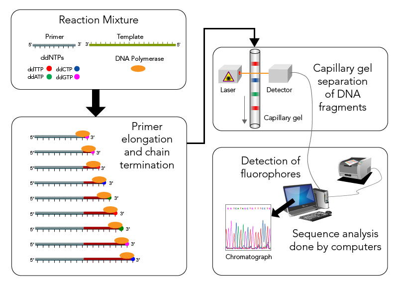
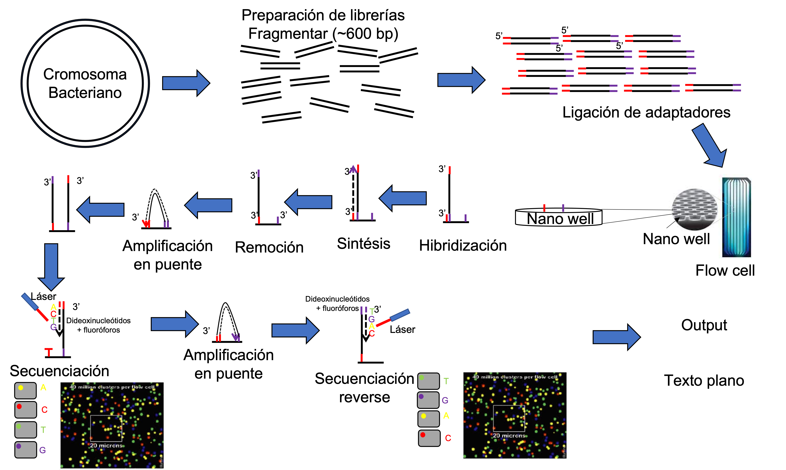
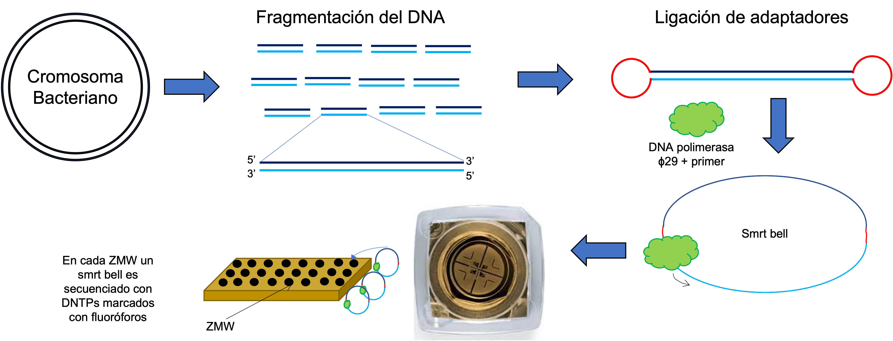
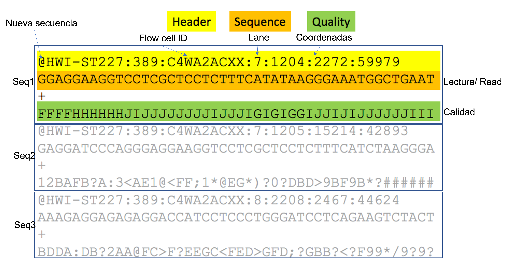

```{r xaringan-themer, include=FALSE, warning=FALSE}
library(xaringanthemer)
style_mono_accent(
  base_color = "#1c5253",
  header_font_google = google_font("Josefin Sans"),
  text_font_google   = google_font("Montserrat", "300", "300i"),
  code_font_google   = google_font("Fira Mono")
)
```


```{r xaringan-logo1, echo=FALSE}
library(xaringan)
library(xaringanExtra)
library(emo)
library(knitr)
```

```{r setup commen, include=FALSE}
knitr::opts_chunk$set(comment="")
```

```{css, echo = FALSE}
.huge .remark-code { /*Change made here*/
  font-size: 150% !important;
}
.tiny .remark-code { /*Change made here*/
  font-size: 60% !important;
}
```

```{r update1, eval = FALSE, echo=FALSE}
xaringan::inf_mr()
```

```{r xaringan-editable, echo=FALSE}
xaringanExtra::use_editable(expires = 1)
```

```{r share-again, echo=FALSE}
xaringanExtra::use_share_again()
```

```{r xaringan-panelset, echo=FALSE}
xaringanExtra::use_panelset()
```

```{css, echo = FALSE}
.huge .remark-slide-content { /*Change made here*/
  font-size: 30 px !important;
}
.tiny .remark-slide-content { /*Change made here*/
  font-size: 7 px !important;
}
.big .remark-slide-content { /*Change made here*/
  font-size: 18 px !important;
}
.normal .remark-slide-content { /*Change made here*/
  font-size: 14 px !important;
}
```

```{r echo=FALSE}
style_panelset_tabs(foreground = "honeydew", background = "seagreen")
```

```{r update, eval = FALSE, echo=FALSE}
xaringan::inf_mr()
```

```{r xaringanExtra-clipboard, echo=FALSE}
htmltools::tagList(
  xaringanExtra::use_clipboard(
    button_text = "<i class=\"fa fa-clipboard\"></i>",
    success_text = "<i class=\"fa fa-check\" style=\"color: #90BE6D\"></i>",
    error_text = "<i class=\"fa fa-times-circle\" style=\"color: #F94144\"></i>"
  ),
  rmarkdown::html_dependency_font_awesome()
)
```

```{r xaringan-extra-styles, echo=FALSE}
xaringanExtra::use_extra_styles(
  hover_code_line = TRUE,         #<<
  mute_unhighlighted_code = TRUE  #<<
)
```

```{r use-logo, echo=FALSE}
xaringanExtra::use_logo("imgs/1.png")
```


```{r xaringan-tile-view, echo=FALSE}
xaringanExtra::use_tile_view()
```


## Grupo de Ecologia Microbiana e Multi-ômicas - GEMM

GEMM es un grupo de investigación de la Universidade Estadual de Campínas, liderado por la **Doctora Valéria Maia Merzel**. Sus laboratorios están localizados dentro del Centro Pluridisciplinar de Pesquisas Químicas, Biológicas e Agrícolas - CPQBA y hace parte de la división de recursos microbianos - DRM. 

Nuestras principales líneas de investigación son:

* Ecologia Microbiana Molecular
* Bioprospección genómica
* Microbiología Ambiental.

Nuestros principales intereses incluyen la compresión de la composición y el funcionamiento de las comunidades microbianas y de sus interacciones a travez del uso de abordajes multi-ómicas, con foco en ambientes asociados a petróleo y ambientes extremos como la Antártica.

---

## Grupo de Ecologia Microbiana e Multi-ômicas - GEMM

Integrantes:

**Alumnos de maestría**
* 🇨🇴 **Alejandra Calderón Fajardo:** Microbióloga de la Universidad de Pamplona⛽

** Alumnos de doctorado**
* 🇵🇪 **MsC. Melissa Santa Cruz:** Bióloga de la Universidad de Trujillo - Perú 🥶
* 🇧🇷 **MsC. Jéssica Silva:** Bióloga de la Pontificia Universidade Católica de Campinas ⛽ 🥶
* 🇨🇴 **MsC. Mavi Blanco:** Biólogo de la Universidad Industrial de Santander  🥶
* 🇧🇷 **Victor Borin Centurion:** Biomédico de la Universidade Paulista 🥶 
* 🇧🇷 **MsC. William Medeiros:** Biológo de la Universidade Federal da Integração Latino-Americana -UNILA 🥶
* 🇨🇴 **MsC. Kelly Hidalgo:** Microbióloga Industrial de la Pontificia Universidad Javeriana ⛽ 🥶

---

class: center, middle, inverse

# Teoría Parte I: Secuenciación de ADN

---
## Tecnologías de secuenciación

1. Secuenciación Sanger

.center[

]

* Baseado en primers
* Fragmentos de ~800 bp

---
## Tecnologías de secuenciación

2. Secuenciación de nueva generación NGS

**Illumina**


.center[

]

[Diferentes plataformas](https://www.illumina.com/systems/sequencing-platforms.html)


---
## Tecnologías de secuenciación

3. Secuenciación de tercera generación

**PacBio**

* *Long reads* ~25kb


.center[

]

---
class: center, middle, inverse

# Teoría Parte II: Calidad de la secuenciación

---
## Cuáles el producto final de la secuenciación?

* Illumina: formato `.fastq` o `.fq`


.center[

]

* Para secuenciación *paired-end*, son dos archivos uno con las lecturas *fordward* y otro con las lecturas *reverse*.

---
class: hide_logo

## Phred Quality Score

* La calidad de las secuencias está determinada por la nota o *score* *Phred*. Según la siguiente ecuación:

$$ q = -10 * log_{10}(P)$$
Donde, $q$ es la nota *Phred* e $P$ es la probabilidad de que la base esté errada. Así entonces:

* $q = 10$ significa 1 base errada a cada 10 (90%); $p = 0.1$
* $q = 20$ significa 1 base errada a cada 100 (99%); $p = 0.01$
* $q = 30$ significa 1 base errada a cada 1000 (99.9%) $p = 0.001$
  
**Mínimo aceptable** $q>20$, **ideal** $q>30$


---
## Phred Quality Score

* Y entonces que son todos esos simbolos? 

.center[

]


---
class: hide_logo

## Phred Quality Score

Para facilitar la escrita y la lectura de la información de calidad, es usada la tabla *ASCII*, para transformar los dos dígitos de *Phred Score* en un caracter solamente, para conseguir leer facilmente la calidad de cada base.


[ASCII table](https://support.illumina.com/help/BaseSpace_OLH_009008/Content/Source/Informatics/BS/QualityScoreEncoding_swBS.htm)

---
## Como evaluar la calidad de las secuencias

**FASTQC** es un programa que permite visualizar la información de calidad de las secuencias de una manera gráfica e interactiva.


<font size=2>Nota: Durante el procesamiento de las secuencias será explorado un reporte FASTQC</font>
---
class: hide_logo

## *Trimming* (Filtración)

Es el proceso de eliminación de las lecturas con baja calidad. Es posible filtrar secuencias baseado en el *score Phred*, o por ambiguedades (remoción de NNs), remoción de adaptadores, remoción de bases al inicio o al final de las secuencias. También es posible trimar por tamaño, por ejemplo eliminar todas las *reads* menores de 50 bp.


**Programas**
*Nota: Exclusivos para secuencias cortas*
* Trimmomatic
* Trimgalore
* Fastx tool kit
---
class: center, middle, inverse

# Tiempo para colocar en práctica!

.center[


---
class: center, middle, inverse

# Práctica I Introducción a Unix

---
## Práctica I

**Contenido**

* Qué es Unix?
* Qué es el terminal?
* Comandos Básicos de Linux


[Click aqui](https://github.com/khidalgo85/Unix)
---

## Práctica II

**Contenido**
* Qué es conda?
* Instalación de programas
* Importación de secuencias
* Organización de directorios de trabajo
* Análisis de la calidad de las secuencias
* *Trimming*


[Click aqui](colgar el pipeline)
---
class: center, middle, inverse

# Continuará...

